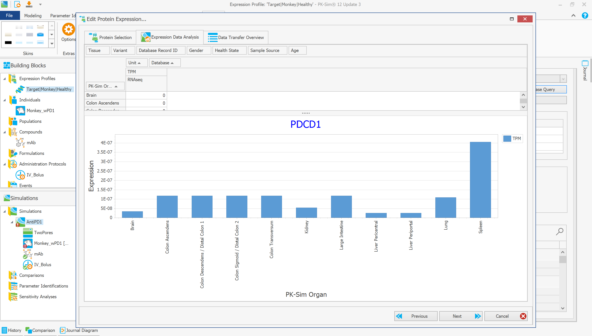
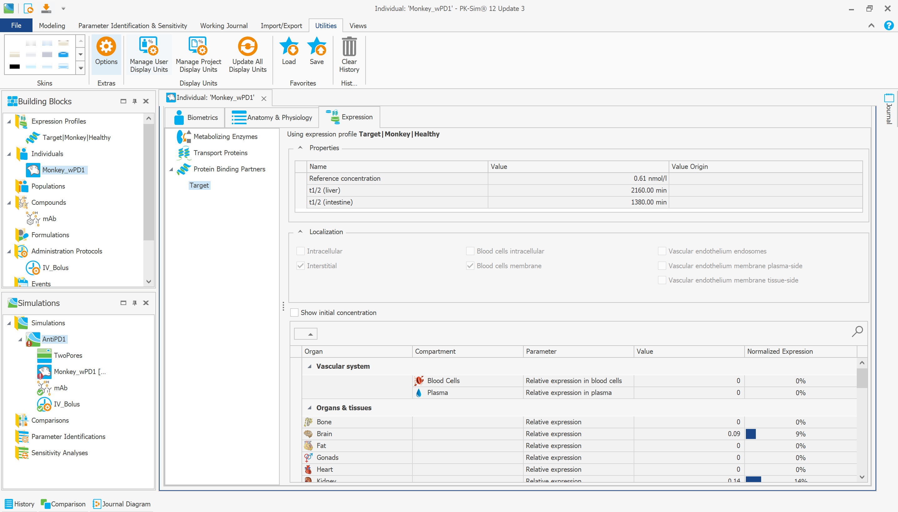
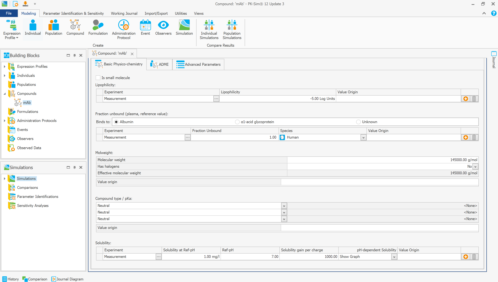
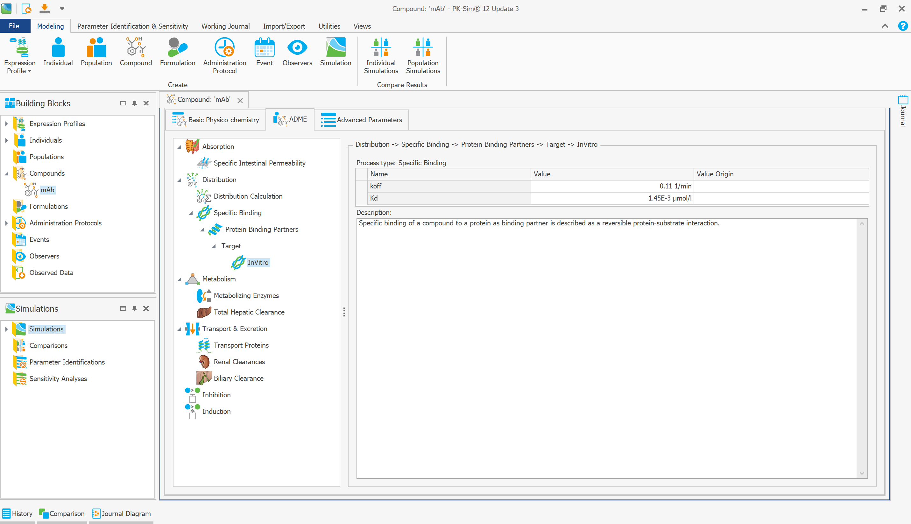
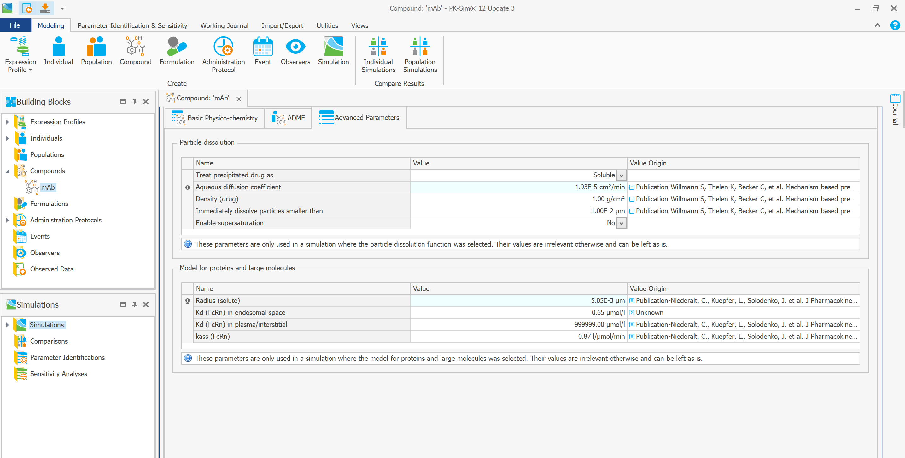
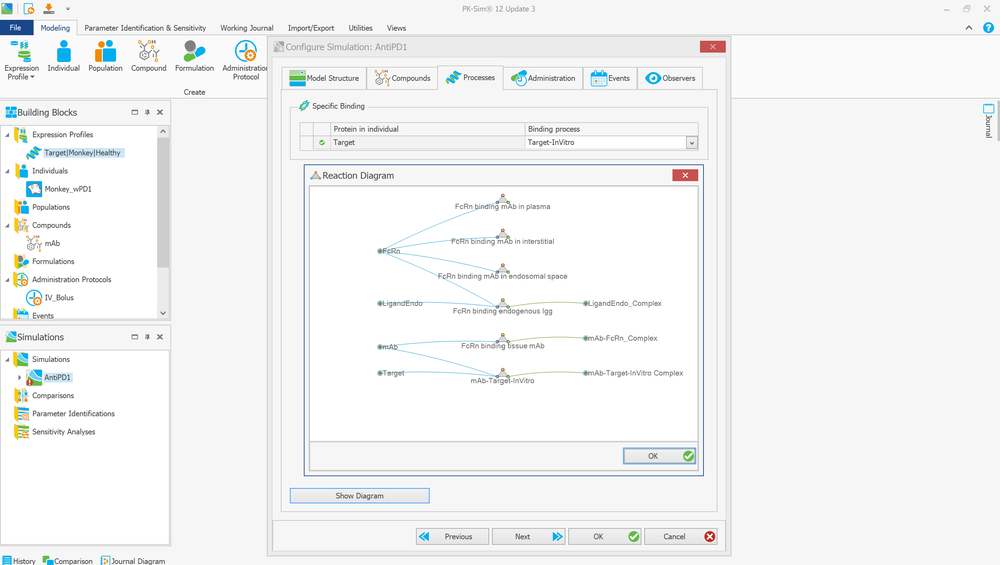
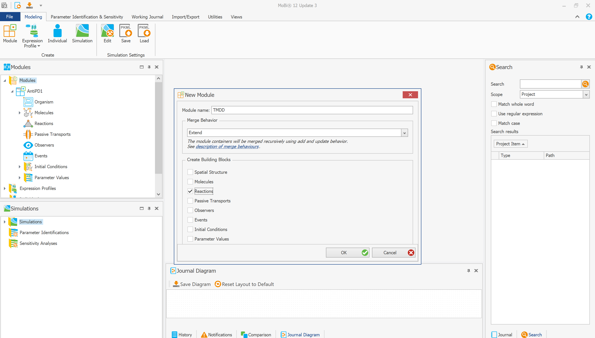
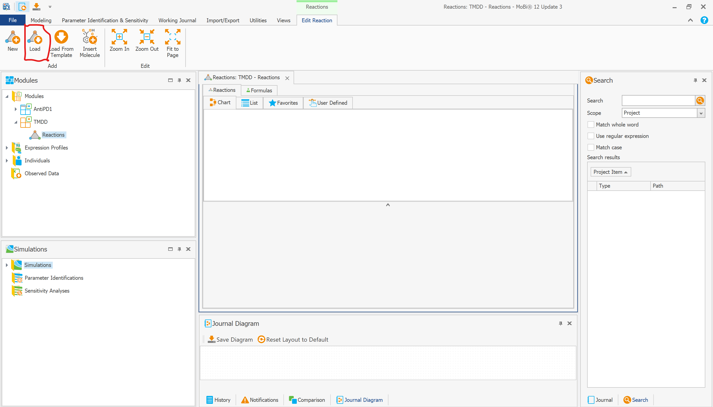
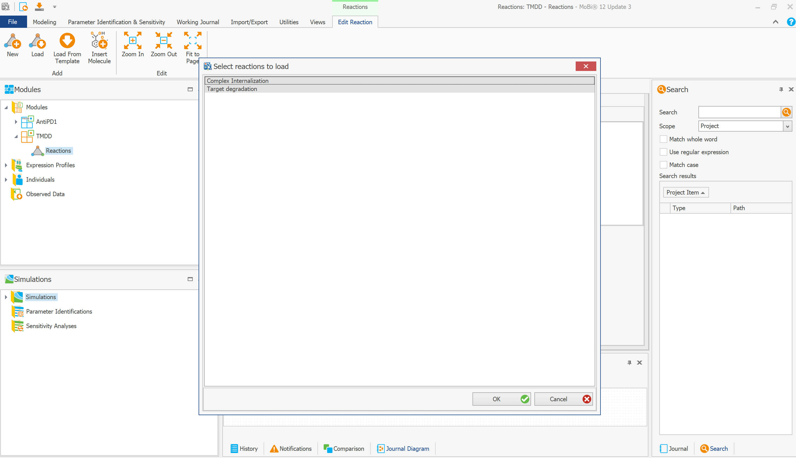
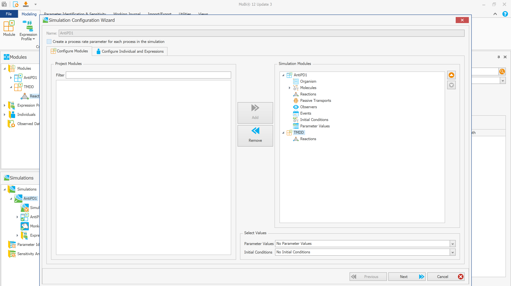

# Preface and prerequisites

This tutorial assumes that the Open Systems Pharmacology (OSP) Suite has been
installed and configured before any model project is opened. The workflow uses
both PK-Sim and MoBi: PK-Sim supplies the species physiology, expression
profile, compound, administration, and base PBPK model; MoBi adds the reusable
TMDD reactions and compiles the combined simulation. Install a compatible OSP
Suite version and confirm project-version compatibility before editing and
saving the supplied `.pksim5` and `.mbp3` files.

Follow the official [OSP Suite Getting Started
instructions](https://docs.open-systems-pharmacology.org/open-systems-pharmacology-suite/getting-started).
In particular:

1. install the OSP Suite with the required permissions; the official installer
   may require administrator rights and a computer restart;
2. install both PK-Sim and MoBi to reproduce the complete workflow;
3. download the PK-Sim gene expression databases from the release location
   linked in the OSP instructions;
4. place the database files in a stable location that PK-Sim and all intended
   users can read;
5. connect the downloaded databases in **PK-Sim Options**, following the link
   to the PK-Sim options documentation on the Getting Started page; and
6. confirm that the required species and target gene can be queried before
   creating an expression profile.

The OSP Suite interfaces to R are separate from the desktop applications. They
are needed for the later scripted workflow but not for the graphical model
construction described on this page. The required R packages and versions are
checked by the scripts under `02_APriori_PBPK_Workflow/Scripts/`.

# Purpose

This folder contains the source PK-Sim and MoBi projects and the compiled PKML
simulations used by the downstream R workflow. A separate model is maintained
for each species--target combination. The model-building sequence is:

1. create the species- and target-specific PBPK model structure in PK-Sim;
2. export the PK-Sim simulation to MoBi;
3. extend the model in MoBi with the generic target-mediated drug disposition
   (TMDD) reactions;
4. generate the combined MoBi simulation; and
5. export the compiled simulation as a PKML file for use by the R scripts.

The files in this directory are model inputs, editable project files, compiled
simulation exports, and documentation snapshots. They are not simulation
results.

# Folder contents

## `PK-Sim_Mobi_Files_Monkey/`

This folder contains the editable monkey model projects.

| Target | PK-Sim project (`.pksim5`) | MoBi project (`.mbp3`) |
|---|---:|---:|
| IL-6R | `AntiIL6R.pksim5` | `AntiIL6R.mbp3` |
| PD-1 | `AntiPD1.pksim5` | `AntiPD1.mbp3` |
| PD-L1 | `AntiPDL1.pksim5` | `AntiPDL1.mbp3` |
| TNFA | `AntiTNFA.pksim5` | `AntiTNFA.mbp3` |
| VEGFA | `AntiVEGFA.pksim5` | `AntiVEGFA.mbp3` |

The `.pksim5` files are the PK-Sim source projects used to construct the base
PBPK simulations. The `.mbp3` files are the corresponding MoBi projects after
the simulations have been transferred to MoBi and extended with TMDD.

## `PK-Sim_Mobi_Files_Human/`

This folder contains the editable human model projects.

| Target | PK-Sim project (`.pksim5`) | MoBi project (`.mbp3`) |
|---|---:|---:|
| IL-6R | `AntiIL6R.pksim5` | `AntiIL6R.mbp3` |
| PD-1 | -- | `AntiPD1.mbp3` |
| PD-L1 | -- | `AntiPDL1.mbp3` |
| TNFA | -- | `AntiTNFA.mbp3` |
| VEGFA | -- | `AntiVEGFA.mbp3` |

Only the human IL-6R PK-Sim source project is present in this folder. MoBi
project files are present for all five human targets.

## `PKML_Files_Monkey/PKML_Files_Monkey/`

This nested folder contains the compiled monkey simulations:

- `AntiIL6R.pkml`
- `AntiPD1.pkml`
- `AntiPDL1.pkml`
- `AntiTNFA.pkml`
- `AntiVEGFA.pkml`

It also contains `TMDD.pkml`, the reusable generic TMDD reaction building block
loaded into the MoBi projects. The target-specific `Anti*.pkml` files are final
compiled simulations; `TMDD.pkml` is an intermediate reusable model component.

## `PKML_Files_Human/PKML_Files_Human/`

This nested folder contains the five compiled human simulations:

- `AntiIL6R.pkml`
- `AntiPD1.pkml`
- `AntiPDL1.pkml`
- `AntiTNFA.pkml`
- `AntiVEGFA.pkml`

## `Snapshots/`

This folder contains the screenshots used below. Snapshots `0.1` through `4`
show construction of the PK-Sim model. Snapshots `5` through `8` show addition
of the generic TMDD reactions and creation of the combined simulation in MoBi.

# Model-building workflow

The screenshots use the monkey anti-PD-1 model as an example. The same overall
workflow is applied separately to each species and target.

## 1. Define the target expression profile in PK-Sim

Create the target protein expression profile for the selected species. Map the
available expression data to PK-Sim organs and review the tissue distribution.
Snapshot 0.1 shows the PDCD1 expression data used for the monkey PD-1 example.

The OSP-compatible expression databases described by [Cordes and Rapp
(2023)](https://doi.org/10.1002/psp4.12904) provide curated, cross-species bulk
RNA-sequencing data from healthy, normal, untreated primary tissues. The gene
expression profile supplies the **relative tissue distribution** of the target
protein binding partner. RNA expression is a surrogate for protein abundance,
not a direct measurement of protein concentration or activity. Review the
selected database records, tissue-to-organ mapping, species, health state, and
other available metadata rather than accepting every returned record without
inspection. [Meyer et al. (2012)](https://doi.org/10.1124/dmd.111.043174)
describe the underlying use of tissue-specific expression data to quantify
active processes in PBPK models.

{fig-alt="PK-Sim protein expression editor showing PDCD1 expression by organ"}

Next, assign the expression profile to the species-specific individual. Define
the target reference concentration, target half-life information when
applicable, cellular or tissue localization, and relative organ expression.
The database-derived relative expression pattern and the absolute reference
concentration play different roles: relative expression distributes the target
among tissues, while the reference concentration scales that pattern to model
concentrations. The reference concentration and localization therefore require
target-specific evidence and should remain traceable to their source. They
should not be inferred from transcript counts alone.

{fig-alt="PK-Sim individual expression settings for the monkey target"}

## 2. Define the monoclonal antibody compound

Create the antibody as a large-molecule compound and enter its relevant
physicochemical properties, including molecular weight and protein binding
settings. Snapshot 1 shows the basic compound definition used in this example.

{fig-alt="PK-Sim monoclonal antibody basic physicochemistry settings"}

Add the target as a protein binding partner and define the reversible specific
binding process. The binding parameters shown by PK-Sim include the dissociation
constant (`Kd`) and dissociation rate constant (`koff`). These values must be
set for the antibody--target pair represented by the model.

{fig-alt="PK-Sim specific binding process with Kd and koff"}

Configure the protein and large-molecule model, including the solute radius and
FcRn-related parameters used for antibody disposition. This structure is based
on the generic whole-body PBPK model for therapeutic proteins developed for
PK-Sim by [Niederalt et al.
(2018)](https://doi.org/10.1007/s10928-017-9559-4). The model represents
large-molecule extravasation using the two-pore formalism, lymphatic return,
endosomal uptake and clearance, and protection from endosomal clearance through
FcRn binding and recycling. Solute radius influences transcapillary exchange,
whereas the endosomal FcRn affinity controls a distinct recycling mechanism.
The target-specific nonlinear clearance mechanism is not supplied by this base
large-molecule structure; it is completed by the specific binding process and
the TMDD extension described below.

{fig-alt="PK-Sim advanced parameters for the protein and large-molecule model"}

## 3. Assemble and check the PK-Sim simulation

Create the species- and target-specific simulation from the individual,
compound, administration protocol, and selected processes. Confirm that the
individual's target is connected to the compound's target-binding process. The
reaction diagram provides a final check of the base large-molecule and specific
binding structure before transfer to MoBi.

{fig-alt="PK-Sim simulation configuration and reaction diagram"}

Save the PK-Sim project as a `.pksim5` file, then export or transfer its
simulation to MoBi. The transferred simulation supplies the base PBPK spatial
structure, molecules, processes, administration, and other simulation building
blocks that will be extended in the next step.

## 4. Add the generic TMDD reactions in MoBi

OSP Suite version 12 organizes a MoBi project into modules, building blocks,
and simulations. The official [MoBi modularization concept
documentation](https://docs.open-systems-pharmacology.org/v12/working-with-mobi/mobi-documentation/modularization-concept)
recommends preserving the module transferred from PK-Sim and implementing
structural changes in a separate extension module. This separation makes the
TMDD mechanism reusable across target-specific PBPK models and keeps the
provenance of the PK-Sim structure clear.

In the MoBi project, create a module named `TMDD`, use the **Extend** merge
behavior, and include a Reactions building block. Extending the transferred
module preserves the base PBPK model while adding the TMDD reactions. In the
simulation configuration, place the transferred PK-Sim module before the TMDD
extension so that the extension is applied to the base structure. Reaction
entities are matched by name during module combination; keep the reaction and
parameter names unchanged because the downstream R configuration relies on
those names.

{fig-alt="MoBi new TMDD module dialog with Extend merge behavior and Reactions selected"}

Open the TMDD Reactions building block and choose **Load**.

{fig-alt="MoBi TMDD reactions building block with the Load command highlighted"}

Load `PKML_Files_Monkey/PKML_Files_Monkey/TMDD.pkml` and select both generic
reactions:

- `Complex Internalization`, which represents removal of the antibody--target
  complex; and
- `Target degradation`, which represents turnover of unbound target.

The species- and target-specific parameter values used by these reactions are
applied later by the simulation configuration and R workflow; the PKML supplies
the reusable reaction structure. This is the central modularization idea in
this tutorial: one generic TMDD reaction module is loaded into separate
species- and target-specific PBPK projects, and each combined simulation later
receives the appropriate parameter values.

{fig-alt="MoBi dialog listing Complex Internalization and Target degradation reactions"}

## 5. Generate and export the combined MoBi simulation

Create a new simulation in MoBi and include both the transferred, target-specific
PK-Sim module and the extending `TMDD` module. Review the individual and
expression selections in the configuration wizard, then generate the combined
simulation.

{fig-alt="MoBi simulation configuration wizard showing the AntiPD1 and TMDD modules"}

Save the editable MoBi project as an `.mbp3` file. After checking that the
combined simulation contains the expected PBPK and TMDD structures, export the
compiled simulation as the corresponding target-specific `.pkml` file in the
species-specific `PKML_Files_*` folder.

Before exporting, verify that:

- the intended species-specific individual and target expression profile are
  selected;
- both the transferred PK-Sim module and the `TMDD` extension module are in the
  simulation configuration;
- the antibody, target, antibody--target complex, `Complex Internalization`, and
  `Target degradation` entities are present;
- the reaction and parameter names still match the names expected by the R
  scripts; and
- the generated simulation is current with respect to its modules and building
  blocks.

# Use by the downstream R workflow

The target-specific compiled PKML files are the hand-off from graphical model
development to scripted simulation. In
`02_APriori_PBPK_Workflow/Scripts/01_Setup_Configurations.qmd`, each species and
target is mapped to its compiled PKML path. The later scripts load those models,
apply molecule-, target-, species-, and dose-specific settings, run the a priori
simulations, and process the outputs.

The configuration script expects the following exact parameter-to-entity
mapping:

| Input parameter | Model entity | Unit expected by the configuration workflow |
|---|---|---:|
| `Kd (FcRn) in endosomal space` | `mAb` | µmol/l |
| drug--target `Kd` | `mAb-Target-InVitro` | µmol/l |
| drug--target `koff` | `mAb-Target-InVitro` | 1/min |
| complex internalization rate `kint` | `Complex Internalization` | 1/h |
| target degradation rate `kdeg` | `Target degradation` | 1/h |
| target `Reference concentration` | `Target` | nmol/l |

Because these names are used to find parameters programmatically, renaming an
entity in PK-Sim or MoBi without making the corresponding R change will break
the hand-off even if the compiled PKML itself can be opened.

In short, the file flow is:

`PK-Sim project (.pksim5)` &rarr; `MoBi project with TMDD (.mbp3)` &rarr;
`compiled simulation (.pkml)` &rarr; `R-based a priori simulation workflow`.

The `.pksim5` and `.mbp3` files should be edited only when changing the model
structure. The target-specific `.pkml` files should be regenerated after such a
structural change so that the R workflow uses the updated compiled model.

# References and further reading

- Cordes H, Rapp H. Gene expression databases for physiologically based
  pharmacokinetic modeling of humans and animal species. *CPT Pharmacometrics &
  Systems Pharmacology*. 2023;12(3):311-319.
  [doi:10.1002/psp4.12904](https://doi.org/10.1002/psp4.12904).
- Meyer M, Schneckener S, Ludewig B, Kuepfer L, Lippert J. Using expression data
  for quantification of active processes in physiologically based
  pharmacokinetic modeling. *Drug Metabolism and Disposition*.
  2012;40(5):892-901.
  [doi:10.1124/dmd.111.043174](https://doi.org/10.1124/dmd.111.043174).
- Niederalt C, Kuepfer L, Solodenko J, Eissing T, Siegmund H, Block MS, et al. A
  generic whole body physiologically based pharmacokinetic model for therapeutic
  proteins in PK-Sim. *Journal of Pharmacokinetics and Pharmacodynamics*.
  2018;45(2):235-257.
  [doi:10.1007/s10928-017-9559-4](https://doi.org/10.1007/s10928-017-9559-4).
- Lippert J, Burghaus R, Edginton AN, Frechen S, Karlsson MO, Kovar A, et al.
  Open Systems Pharmacology Community--An Open Access, Open Source, Open Science
  Approach to Modeling and Simulation in Pharmaceutical Sciences. *CPT
  Pharmacometrics & Systems Pharmacology*. 2019;8(12):878-882.
  [doi:10.1002/psp4.12473](https://doi.org/10.1002/psp4.12473).
- Shah DK, Betts A. Towards a platform PBPK model to characterize the plasma and
  tissue disposition of monoclonal antibodies in preclinical species and human.
  *Journal of Pharmacokinetics and Pharmacodynamics*. 2012;39(1):67-86.
  [doi:10.1007/s10928-011-9232-2](https://doi.org/10.1007/s10928-011-9232-2).
- Glassman PM, Balthasar JP. Physiologically-based modeling of monoclonal
  antibody pharmacokinetics in drug discovery and development. *Drug Metabolism
  and Pharmacokinetics*. 2019;34(1):3-13.
  [doi:10.1016/j.dmpk.2018.11.002](https://doi.org/10.1016/j.dmpk.2018.11.002).
- Open Systems Pharmacology. [Getting
  Started](https://docs.open-systems-pharmacology.org/open-systems-pharmacology-suite/getting-started).
- Open Systems Pharmacology. [MoBi modularization concept, version
  12](https://docs.open-systems-pharmacology.org/v12/working-with-mobi/mobi-documentation/modularization-concept).
